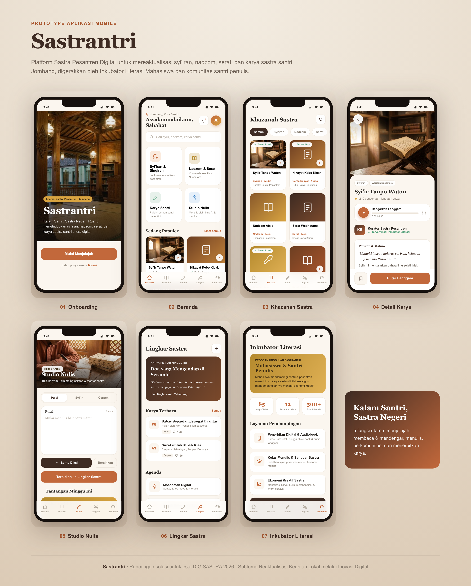

# Sastrantri

> **Kalam Santri, Sastra Negeri** — Platform Sastra Pesantren Digital, Jombang.

Prototipe aplikasi mobile yang mereaktualisasi khazanah sastra pesantren (syi'iran, nadzom, serat, cerita rakyat, dan karya santri) ke dalam bentuk digital yang interaktif. Dibuat sebagai rancangan solusi untuk **Lomba Menulis Esai DIGISASTRA 2026** (kategori Mahasiswa).

**Subtema:** Reaktualisasi Kearifan Lokal melalui Inovasi Digital.

---

## Tampilan



| # | Layar | Fungsi |
|---|-------|--------|
| 01 | Onboarding | Halaman pembuka, ajakan mulai menjelajah |
| 02 | Beranda | Pencarian, pintasan, karya populer, tantangan |
| 03 | Khazanah Sastra | Perpustakaan karya + filter kategori |
| 04 | Detail Karya | Petikan & makna, pemutar langgam, simpan |
| 05 | Studio Nulis | Menulis + hitung kata + saran diksi |
| 06 | Lingkar Sastra | Karya pilihan, feed, suka, agenda |
| 07 | Inkubator Literasi | Statistik, pendampingan, ekonomi kreatif |

---

## Fitur Interaktif

- Navigasi bawah berpindah antar 5 tab utama.
- Filter kategori pada Khazanah Sastra (Semua / Syi'iran / Nadzom / Serat / Cerpen / Rakyat).
- Pemutar langgam dengan progress bar berjalan.
- Tombol simpan (bookmark) & suka (like).
- Studio menulis: hitung kata otomatis + tombol "Bantu Diksi".

## Kebaruan

- Fokus pada **tradisi bersastra** pesantren, bukan sekadar aplikasi ngaji atau arsip kitab.
- Mengubah sastra lisan menjadi audio langgam + teks interaktif.
- Dari pembaca menjadi penulis lewat Studio Nulis berbantuan AI.
- Terhubung ke ekonomi kreatif melalui Inkubator Literasi.

---

## Cara Menjalankan

Aplikasi ini satu file statis tanpa dependency.

1. Buka `index.html` di browser (Chrome/Safari/Edge), atau
2. Publish repo ini ke **GitHub Pages** (Settings -> Pages -> Branch `main` -> `/root`), lalu akses lewat URL yang diberikan.

## Struktur

```
sastrantri/
  index.html            # aplikasi (satu file)
  README.md
  assets/
    mockup.png          # showcase 7 layar
    screens/            # tangkapan layar tiap halaman
```

---

_Semua nama karya, tokoh, dan angka pada prototipe bersifat contoh/ilustrasi._
